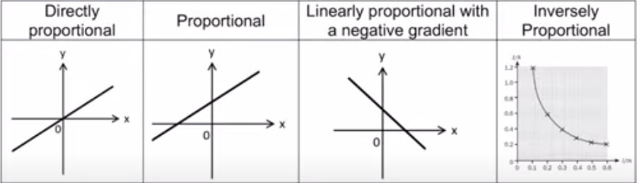

# Data Recording
**DATA RECORDING**

*   Use the precision of the instruments used.   
     
*   Record to the required precision stated in the question  
     
*   Do not write units in the data, instead state them in the headings.  
     
*   No fractions can be used, round up/down  
     

**GRAPH PLOTTING**

*   Use a suitable scale that fits the size of the graph paper used. Larger graphs are more accurate  
     
*   All data points need to be within the graph.   
     
*   It is almost always require to have an intercept, it is recommended to start from 0  
     
*   Origin must be stated clear
*   
    
    Above are the relationships and the relevant graphs.
    
*   DO NOT use “MMM increases when NNN increases”